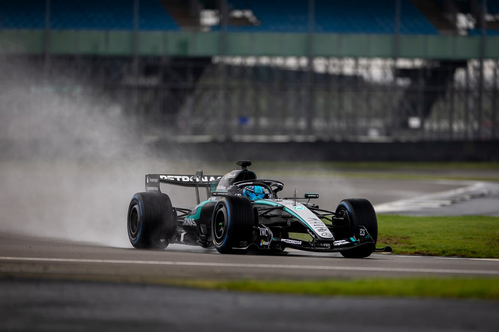
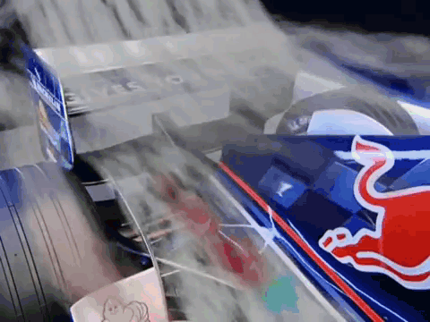
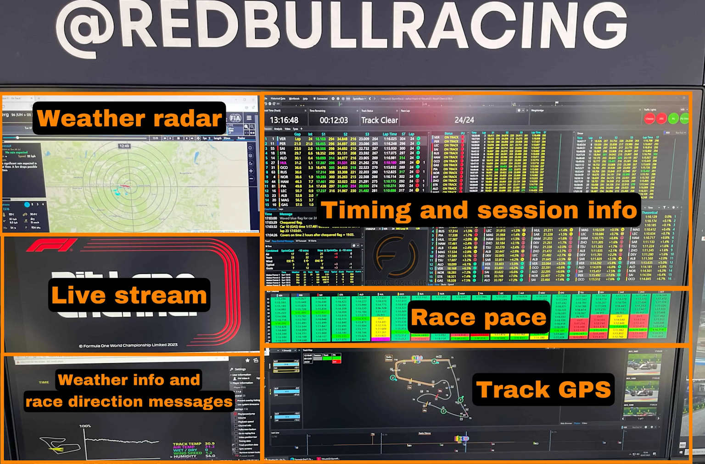
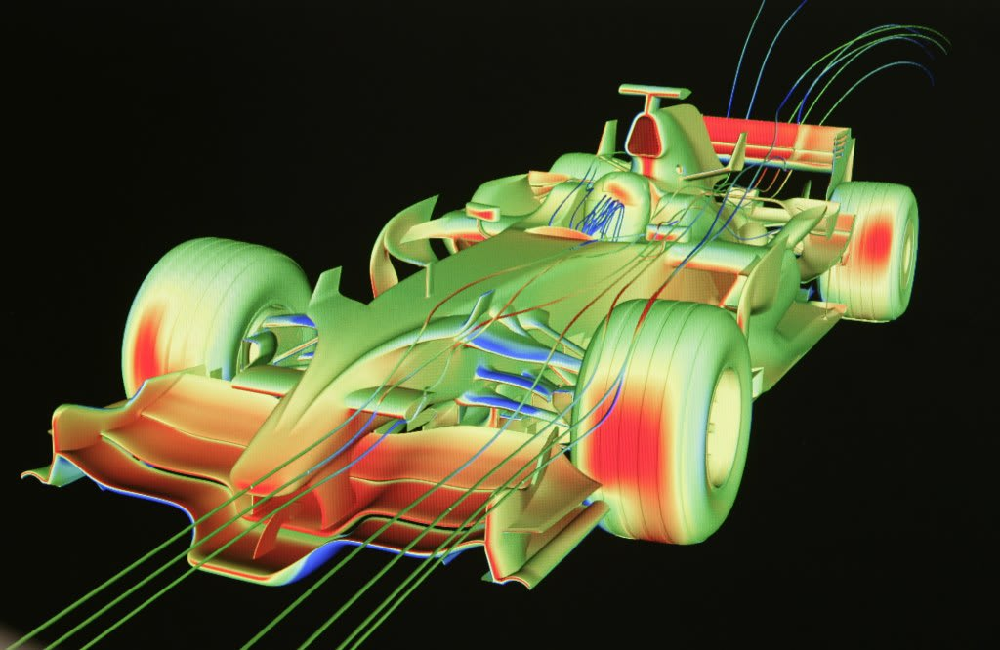
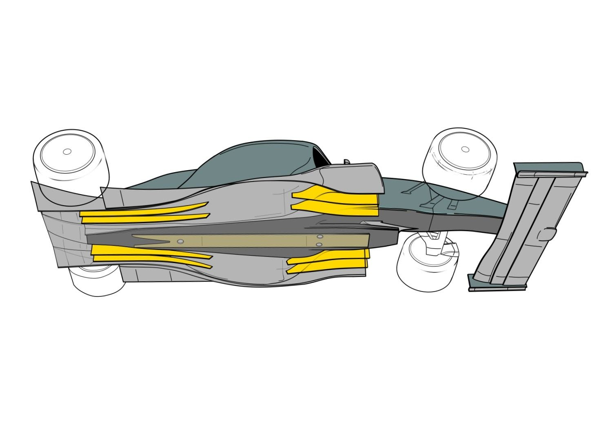
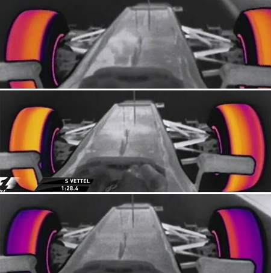
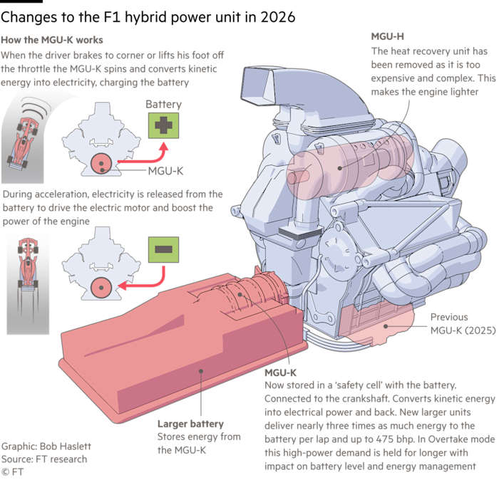
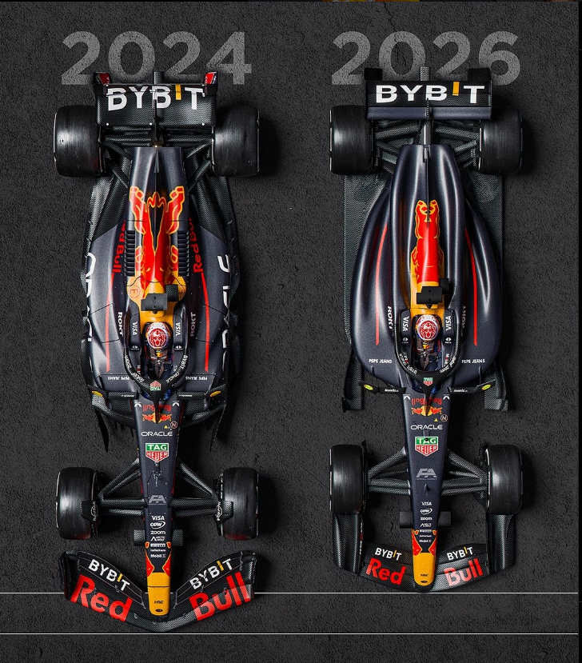
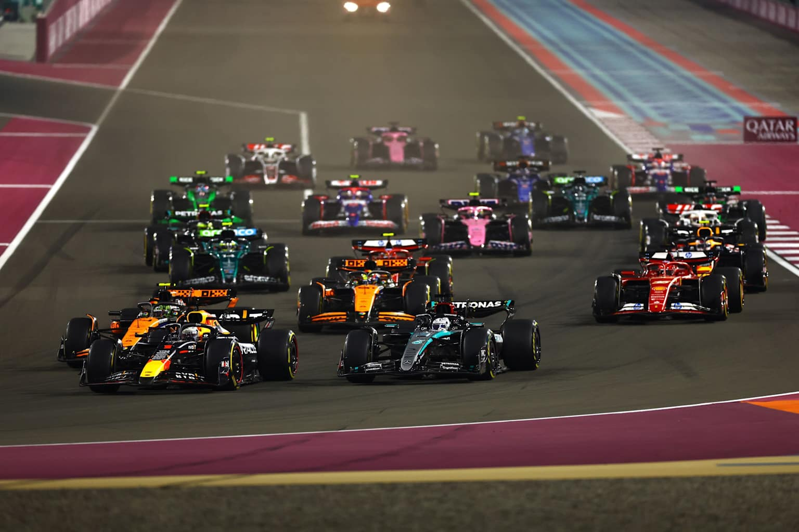

# FORMULA 1 -The pinnacle of motorsport
## Beyond the Race
*Strategy, Physics & Engineering — Updated for the 2026 Era*

---



---

> *The regulations are not a limitation on innovation. They are the frame that makes the competition meaningful — and they just got completely rewritten.*

---

## Introduction

Most people think F1 is just 20 drivers going in circles. The driving is almost beside the point — what actually decides races is the strategy call at lap 28, the tire compound chosen the night before, the aerodynamic compromise some engineer made six months ago to comply with a regulation.

F1 is a competition between engineering departments. Sunday's race is the last step in a process involving hundreds of engineers, vast simulation infrastructure, and budgets rivalling the GDP of small nations. Understanding the sport means understanding what happens in the factory, the wind tunnel, and the data center — not just on track.



---

## 1. Race Strategy

Every F1 race is a live optimization problem. Teams manage tire degradation, fuel loads, gap calculations, safety car probabilities, and weather forecasts — all while communicating with a driver doing 300 km/h who has about two seconds to process any instruction.



### Tires and Pit Windows

Tires remain the biggest strategic lever. Teams run millions of simulations before the race; those models update in real time as lap times, competitor strategies, and tire temperatures feed in. A strategist may call a pit stop based on a gap closing by 0.3 seconds over three laps — a margin invisible on TV but decisive in the standings.


The **undercut (pit early for a fresh tire advantage)** and **overcut (stay out and bank time while rivals degrade)** are the two core strategic moves. Getting either wrong costs positions. Getting them right at the moment a virtual safety car appears can swing a result by five places.

``` 
A safety car is deployed when there has been some incident on the track reducing the pace of the race and giving time for the track to made secure to race again. 

```


### Energy Management — The New Strategic Dimension `[2026]`

From 2026, strategy has a new and far more complex dimension: electrical energy. The power unit now splits output roughly 50-50 between the combustion engine and electric motor, and the battery depletes rapidly on long straights. Drivers must harvest energy under braking and on lift-off, then deploy it tactically — making every lap a fuel-and-energy balancing act that changes circuit by circuit.

| Mode | What it does |
|---|---|
| **Boost Mode** | Driver-controlled deployment of extra electrical power to attack or defend |
| **Recharge Mode** | Harvests energy by lifting off the throttle — but disables Active Aero while active |
| **Overtake Mode** | Unlocks +0.5MJ extra harvestable energy and a higher power profile when within 1 second of the car ahead |


This has split opinion early in the 2026 season. Overtaking numbers are up — roughly three times as many passes as the Melbourne race a year ago .

---

## 2. Applied Physics

An F1 car is fast not because of a powerful engine, but because every component — from the front wing endplate to the floor edge — manipulates airflow to generate downforce, reduce drag, or manage temperatures. The engine is almost secondary to the aerodynamic architecture surrounding it.




### Downforce, Drag, and the 2026 Trade-off `[2026]`

Downforce pushes the car into the tarmac, enabling higher cornering speeds. Drag costs straight-line speed. The entire design of an F1 car is a negotiation between these two forces.

In 2026, overall downforce levels have been reduced — the cars are estimated to be around two seconds per lap slower than the 2022–2025 generation — but the FIA designed this reduction specifically to reduce turbulent wake. A car 20 meters behind a rival now retains roughly 90% of its total downforce, up from around 70% by the end of 2025. The goal is closer racing.


### Active Aerodynamics — New for 2026 `[2026]`

The most significant aerodynamic change in decades: **the wings now move.** Both front and rear wing elements adjust angle depending on where the car is on circuit, controlled by the FIA standard ECU. There are two fixed positions:

- **Corner Mode** — flaps closed, maximum downforce, full grip through corners
- **Straight-Line Mode** — flaps open, reduced drag, higher top speed on designated straights

This replaces DRS — the simple rear-wing flap that required a driver to be within one second of the car ahead to activate. Active Aero is available to every driver on every lap, regardless of race position.


### Ground Effect Out, Flatter Floors In `[2026]`

The Venturi tunnels that defined car design from 2022–2025 are gone. The 2026 regulations replace the long ground-effect tunnels with a flatter floor and an extended diffuser with larger openings. This reduces underfloor downforce and raises required ride height — but also reduces aero sensitivity, making the cars far less disruptive to follow at close range.


> *At full speed, a 2025 car generated enough downforce to theoretically drive upside down on a ceiling. The 2026 cars generate less — by design. The trade-off is racing that does not fall apart the moment one car gets within 15 meters of another.*

### Tire and Brake Physics

Tires work within a temperature window as narrow as 10 degrees Celsius — too cold, no grip; too hot, rapid degradation. In 2026, the Pirelli tires are narrower (25mm front, 30mm rear), cutting weight and drag alongside the contact patch.



Brake bias — the distribution of braking force between front and rear axles — is still managed by the driver mid-lap. Under hard braking, weight transfers forward. Miscalibrate the bias and tires lock. Drivers adjust this in fractions of a percent, at 200 km/h, while managing everything else simultaneously.

---

## 3. Engineering Within the Rules

The FIA Technical Regulations span over 100 pages. Teams spend hundreds of millions finding performance inside those pages. Every time a specific solution is banned, teams find three more. Every grey area gets exploited until the regulator closes it.

### The 2026 Power Unit Overhaul `[2026]`

The core is still a 1.6-litre V6 turbo hybrid — but almost everything else has changed.



| Change | Detail |
|---|---|
| **MGU-H removed** | Eliminated heat recovery — removes a major cost and complexity barrier to new entrants |
| **MGU-K tripled** | Roughly 3× more electrical power; battery depletes faster, forcing constant energy management |
| **Sustainable fuel** | Advanced Sustainable Fuel from carbon capture, municipal waste, and non-food biomass |
| **New manufacturers** | Audi (full works), Ford (with Red Bull Powertrains), Honda (independent, with Aston Martin) |


### The Nimble Car Concept `[2026]`

In response to years of cars growing heavier and longer, the 2026 regulations introduce deliberate size reductions:

- Wheelbase shortened 200mm to 3.4m
- Floor 100mm narrower
- Tires slimmer
- Wheel arch covers removed

Drivers have described the new cars as noticeably more nimble through corners, even with lower overall downforce.


### The Budget Cap — Expanded for 2026 `[2026]`

The cost cap has been raised to account for the regulation transition: from $135m to $215m for chassis development, and from $95m to $130m for power units. The cap itself remains in place — organizational efficiency and simulation quality are still differentiators money alone cannot fully buy.

---

## 4. The Driver

None of this works without the driver. But their job is not what most people think it is.


An F1 driver manages over 1,500 inputs per lap — steering, braking, throttle, wing modes, energy deployment, brake bias, tire management, and pit wall communication — while sustaining lateral forces up to 5G. In 2026, energy state is now a moment-to-moment tactical decision, not just a background variable.

The best drivers are not simply fast. They are fast while feeding back precise, repeatable information about what the car is doing. A driver who can describe "the front is washing out in the last third of Turn 7 when the battery drops below 40%" is more valuable than one who is marginally quicker but cannot explain why. Telemetry confirms everything — but the driver's description of a problem usually directs where engineers look first.


> *"The gap between a top-ten driver and a world champion is often not raw pace. It is the ability to manage a 90-minute race at 97% while keeping 3% in reserve for the moment it matters."*

---

## Conclusion

Formula 1 has always been an engineering competition dressed as a motor race. The 2026 regulations have made that more true than ever. Smaller, lighter cars. Active wings. A 50-50 combustion-electric power split. Sustainable fuel. Three new manufacturers on the grid. The complexity has gone up, not down.

Whether the new rules deliver better racing than the previous generation remains a live question — the season is young, and rule tweaks are already being discussed. But the underlying premise is unchanged: every team is working against the same rulebook, trying to find the tenth of a second that the others missed.

The regulations are the frame. The physics is the game. The strategy is how you play it.



---

*`[2026]` tags indicate content new or significantly changed under the 2026 FIA Technical Regulations.*