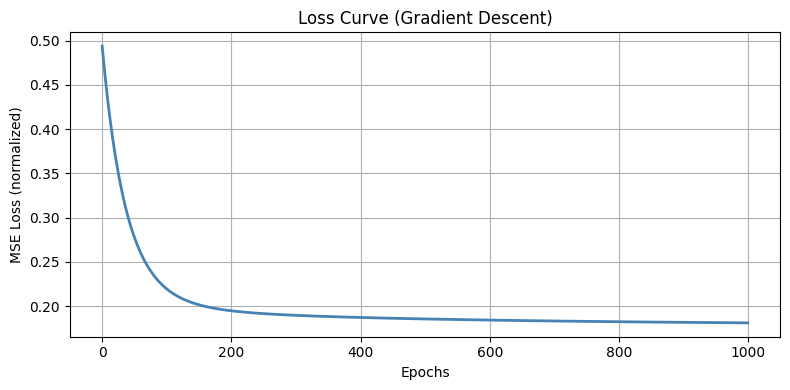

# Build Your Own Brain — Linear Regression

Linear Regression is one of the most foundational ideas in machine learning. At its core, it tries to answer a simple question: given what we know (x), can we predict what we don't (y)?

The assumption is that the relationship between x and y follows a straight line — described by **y = αx + β**, where α controls the slope and β sets where the line crosses the y-axis. The challenge is figuring out the *right* values for these two numbers so the line fits the data as closely as possible.

To measure "closeness," we look at how far off each prediction is from reality, square those differences to avoid negatives cancelling out positives, and sum them all up. The lower this sum, the better the fit.

---

## Gradient Descent (Optimizer formula behind linear regression)

Finding the perfect α and β by hand isn't practical — that's where Gradient Descent comes in. It's an iterative algorithm that nudges the parameters in the right direction, step by step, until the predictions stop improving meaningfully.

Here's how it works in plain terms:

1. **Compute the gradient** — take the derivative of the loss function with respect to each parameter. This tells you which direction the error is increasing.

2. **Start somewhere** — pick random initial values for the slope and intercept. It doesn't need to be a good guess; the algorithm will correct itself.

3. **Evaluate the gradient** — plug the current parameter values into the derivatives. This gives you the steepness of the error curve at that point.

4. **Decide how big a step to take** — multiply the gradient by a small number called the **learning rate**. This controls how aggressively parameters are updated.

5. **Update the parameters** — subtract the step size from the current value. A smaller gradient means a smaller step, which is exactly what you want as you approach the minimum.

6. **Repeat until convergence** — keep going until either the step size becomes negligibly small (say, below 0.001) or you've hit a maximum number of iterations (commonly 1000). Both are just safeguards against running forever or stopping too early.

The name makes sense once you see it in action — the algorithm literally *descends* along the gradient of the loss curve toward its lowest point. When there are multiple parameters, nothing fundamentally changes; you just compute one derivative per parameter.

---

## Gradient Descent — The Math

### 🎯 Cost Function (MSE)

$$J(w) = \frac{1}{2m} \sum_{i=1}^{m} (\hat{y}_i - y_i)^2$$

Where:
- $m$ = number of training samples
- $\hat{y}_i = X_i \cdot w$ = predicted value
- $y_i$ = actual value

> The $\frac{1}{2}$ factor is a convenience trick — it cancels out neatly when you take the derivative, keeping the math clean.

---

### 🔁 Weight Update Rule

$$w := w - \alpha \cdot \frac{\partial J}{\partial w}$$

This is the heartbeat of Gradient Descent. At every step, the weights move in the direction that reduces the cost — scaled by the learning rate $\alpha$.

---

### 📐 Gradient (Derivative of the Cost Function)

$$\frac{\partial J}{\partial w} = \frac{1}{m} X^T (Xw - y)$$

This tells us the slope of the loss curve at the current weights — i.e., how much the cost changes if we nudge each weight slightly.

---

### ⚙️ Full Update Step (Combined)

$$w := w - \alpha \cdot \frac{1}{m} X^T (Xw - y)$$

Where:
- $w$ = weights (parameters being learned)
- $\alpha$ = learning rate (controls step size)
- $X$ = feature matrix
- $y$ = actual target values
- $X^T$ = transpose of the feature matrix

---

### 🔄 Iterative Convergence

$$w_0 \xrightarrow{\alpha} w_1 \xrightarrow{\alpha} w_2 \xrightarrow{\alpha} \cdots \xrightarrow{\alpha} w_{optimal}$$

Each arrow represents one epoch — the weights keep updating until the cost $J(w)$ reaches its minimum. When far from the optimal, steps are large. As the algorithm closes in, steps shrink naturally because the gradient itself becomes smaller.

---

## Evaluation Metrics

Once the model is trained, you need a way to measure how well it actually performs.

### Mean Squared Error (MSE)

MSE is the average of the squared gaps between predicted and actual values across all data points. **Squaring serves two purposes — it makes all errors positive, and it punishes larger mistakes more heavily.**

$$MSE = \frac{1}{n} \sum_{i=1}^{n} (y_i - \hat{y}_i)^2$$

Where:
- $n$ = number of data points
- $y_i$ = actual value for the $i^{th}$ data point
- $\hat{y}_i$ = predicted value for the $i^{th}$ data point

MSE is also commonly used as the loss function *during* training, not just after.

---

### R² — Coefficient of Determination

R² answers a slightly different question — not "how big are the errors?" but "how much of the variation in y does the model actually explain?" It ranges from 0 to 1, with values closer to 1 indicating a stronger fit.

$$R^2 = 1 - \frac{RSS}{TSS}$$

Where:

$$RSS = \sum (y_i - \hat{y}_i)^2 \quad \text{(Residual Sum of Squares)}$$

$$TSS = \sum (y_i - \bar{y})^2 \quad \text{(Total Sum of Squares)}$$

A variant called **Adjusted R²** goes a step further by penalizing models that add unnecessary features — useful for avoiding overfitting.

---

### Other Metrics

**MAE (Mean Absolute Error)** — less sensitive to outliers than MSE since it doesn't square the errors:

$$MAE = \frac{1}{n} \sum_{i=1}^{n} |y_i - \hat{y}_i|$$

**RMSE (Root Mean Squared Error)** — brings the error back to the original unit scale by taking the square root of MSE:

$$RMSE = \sqrt{\frac{1}{n} \sum_{i=1}^{n} (y_i - \hat{y}_i)^2}$$

---

## A Note on Regularization

Even a well-trained linear model can overfit — meaning it performs great on training data but falls apart on new data. Regularization techniques address this by adding a penalty term to the loss function that discourages the model from becoming overly complex. Think of it as a way of telling the model: *don't just memorize the training set, learn something that actually generalizes.*