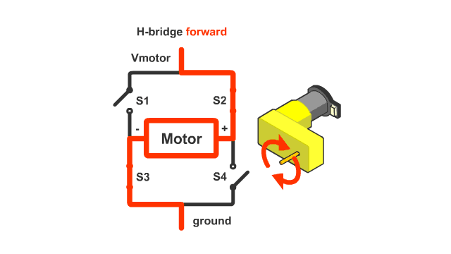
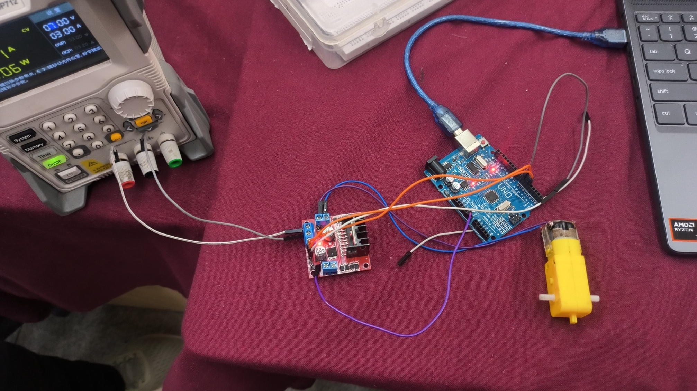
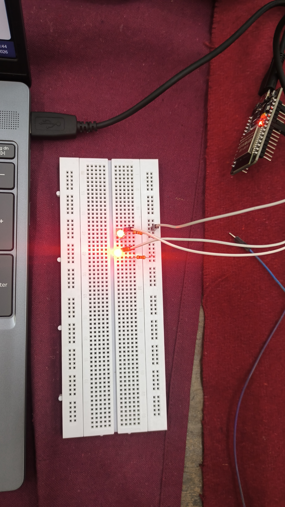

# TASK 2 : API 

An **API (Application Programming Interface)** is a set of rules and protocols that allows different software applications to communicate with each other. I implemented the **OpenWeather API** — a free, widely-used meteorological data service that provides real-time weather information by simply passing a city name or coordinates along with an API key — to build a live weather application using **HTML, CSS and JavaScript**.

From the OpenWeather API, I fetch two types of data: first, **current weather conditions** such as temperature, humidity, wind speed and sky conditions for any city in the world, which I use to dynamically update the UI; and second, **location-based weather data** that maps a user's search query to real-time atmospheric readings pulled directly from weather stations across the globe.

# TASK 3 : Working with Github

GitHub is a web-based platform that provides hosting for Git repositories. It serves as a centralized location to store code, track changes, and collaborate with others using Git — a distributed version control system. GitHub Actions is a built-in CI/CD feature that allows you to automate workflows such as testing and deployment directly from your repository. Issues are used to track bugs, feature requests, and tasks, while Pull Requests are the standard way to propose and review code changes before merging them into the main branch.

My process:
* Visited the given repository at [UVCE-Marvel/git-task](https://github.com/UVCE-Marvel/git-task) and read through the README to understand the tasks required.
* Forked the repository to create a personal copy under my own GitHub account.
* Cloned the forked repository and made the necessary changes as instructed in the README.
* While committing the changes, I created a new branch specifically for this commit to keep the work isolated from the main branch.
* Opened a Pull Request from my new branch, comparing it against the original repository's main branch.
* Reviewed the differences in the Pull Request and submitted it for review.
* Explored GitHub Issues by reading existing ones and understanding how they are used to track tasks and bugs within a project.
[link](https://github.com/bit07Forger/git-task)

# TASK 4 : Getting familiar with command line
Ubuntu is a popular and user-friendly operating system based on Linux, known for being 
open-source, free to use, modify, and distribute. While it comes with a graphical user 
interface,(GUI) it is equally powerful for developers and experienced users who prefer working 
through the command line. The terminal allows direct interaction with the operating system 
through text-based commands, making tasks like file management, automation, and system 
configuration faster and more efficient.

Went through the provided [beginner's guide](https://ubuntu.com/tutorials/command-line-for-beginners#1-overview) 
to get familiar with the basic Linux commands before attempting the subtasks. Carried out 
the following tasks on the Ubuntu terminal:

* Created a new folder called `test` using the `mkdir` command
* Changed into the folder using `cd test`
* Created a blank file without using any text editor using the `touch` command
* Listed the files inside the folder using `ls`
* Created 2600 folders inside `test`, each named with a letter and number combination 
such as `A90` or `A56`, using a loop in the terminal
* Entered random text into two separate `.txt` files using the `echo` command
* Concatenated the two text files and displayed the combined output on the terminal 
using the `cat` command

```
mkdir test
cd test
touch file1.txt file2.txt
ls
mkdir A{1..2600}
echo "this is file one" > file1.txt
echo "this is file two" > file2.txt
cat file1.txt file2.txt
```


# TASK 5 : Build your own Brain (Linear Regression)
## What is Linear Regression?

Think of it this way — you have a bunch of data points scattered on a graph and there 
is no single line that passes through all of them. What you can do is find a **best fit 
line**, one that gets as close as possible to all the points. The small gap between 
where a point actually sits and where the line predicts it to be is called the **error**. 
Regression is about shrinking that error as much as possible. It is the simplest 
prediction algorithm out there and does a pretty decent job at predicting.

---

## The Math Behind It

A straight line follows the equation:

**y = ωx + b**

where **ω** is the slope (called weights in ML) and **b** is the intercept (called bias).

The goal is to find the right values of ω and b that produce the best fit line for a 
given set of data points. The gaps between the actual data points and the line's 
predicted values are the errors the model needs to minimize.

---

## Loss Function

The loss function measures how wrong the model's predictions are. There are two 
common types:

- **MSE (Mean Squared Error)** — squares the errors before averaging them
- **MAE (Mean Absolute Error)** — takes the absolute value of errors before averaging

MSE is more commonly used because it differentiates cleanly, making the underlying 
math far more manageable compared to MAE . [Linear regression](https://github.com/bit07Forger/Marvel_LVL0_report/blob/main/linear_regression.md)

---

# TASK 6 : The Matrix Puzzle (Getting familiar with numpy)

NumPy is a powerful Python library used for numerical computing, providing support for 
large multi-dimensional arrays and matrices along with a collection of mathematical 
functions to operate on them. Matplotlib is a plotting library used to visualize data 
and arrays as graphs and images. Together they form the backbone of data manipulation 
and visualization in Python.

I went through the provided tutorial videos and the NumPy learning document to get familiar 
with array operations such as reshaping, slicing, flipping, and transposing before 
attempting the puzzle. Opened Google collab Notebook and worked through the matrix puzzle 
with the following steps:

1. Installed and imported the NumPy and Matplotlib libraries
2. Loaded the provided `.npy` file containing the scrambled NumPy array
3. Checked the shape of the array to understand its structure and determine the 
correct dimensions for reshaping
4. Reshaped the flat array into a square matrix which unscrambled the data into 
a recognizable structure
5. Rotated the array by 90 degrees to correct its orientation and obtain the final image
6. Used `matplotlib.pyplot.imshow()` to visualize and reveal the hidden image   [Click here to view the notebook](https://colab.research.google.com/drive/1jPIIZG69gxIJNbIUoHnwrZfHpPSZttSx#scrollTo=lDrpy7J9U3m3)


# TASK 8 : Markdown
**Markdown** is a simple markup language for formatting text using basic syntax without complex editor, which can then be converted to structurally valid HTML. It works consistently across different devices and platforms. I learned how to write a markdown with  structured headings,body and embed images,video,gifs in the markdown and wrote a report on F1. [Article](https://github.com/bit07Forger/Marvel_LVL0_report/blob/main/f1.md)

# TASK 9 : Tinkercad

Tinkercad is a free, browser-based CAD and circuit simulation tool by Autodesk that allows 
you to design 3D models and simulate electronic circuits without any physical hardware. It 
is widely used for prototyping Arduino-based projects and is beginner friendly with a 
drag-and-drop interface.

 Built a simple 
circuit using an ultrasonic sensor and an Arduino to estimate the distance between the 
sensor and an obstacle. The ultrasonic sensor works by emitting sound waves and measuring 
the time taken for them to bounce back, which is then used to calculate the distance. 
Displayed the results on the serial monitor in real time.

Following this, built a radar system by combining the ultrasonic sensor with a servo motor. 
The servo motor rotates the sensor across a range of angles to cover a wider detection area, 
while the ultrasonic sensor continuously measures the distance of any object within its 
path. Successfully simulated both circuits on Tinkercad and verified the expected outputs.   [Click here to view the github repo](https://github.com/bit07Forger/ultrasonicsensor)

# TASK 10 : Speed Control of DC Motor

DC motor control involves two key techniques: PWM (Pulse Width Modulation) to control speed 
by adjusting average voltage through rapid on/off switching, and an H-Bridge circuit to 
control rotation direction by reversing current flow through four switching elements. The 
L298N motor driver acts as an intermediary between the Arduino and the motor, amplifying the 
weak control signals from the Arduino into enough current to drive the motor.
## Understanding motor control
Key concepts involved:
* PWM - Pulse Width Modulation helps with the speed control of the motor 
* H-bridge - Allows for the control of the direction of the motor's rotation


 
 ***What exactly is  H-bridge?***

H-bridge is a circuit that contains 4 transistors that acts as switched and two switches close simultanously to decide the direction of the motor spin. **Click the image to view the simulation**

 [](https://drive.google.com/file/d/145kc0o0OgpnAQPuUvbYlA0eLYkSc7Sqd/view?usp=sharing)

# TASK 11 : LED Toggle Using ESP32

The ESP32 is a low-cost microcontroller with built-in Wi-Fi and bluetooth along with multiple GPIO pins that can 
be connected to LEDs, sensors, and other components. It is programmable via the Arduino IDE 
and is widely used in IoT projects that require wireless control of hardware. The goal of 
this task was to host a standalone web server on the ESP32 that allows an LED connected to 
one of its GPIO pins to be toggled on and off remotely from any browser on the same Wi-Fi 
network.

Set up the Arduino IDE with the necessary ESP32 board support package and connected the LED 
to the appropriate GPIO pin with a resistor. Wrote and uploaded a sketch that connects the 
ESP32 to the local Wi-Fi network, after which it obtains an IP address and begins hosting a 
web server. Visiting this IP address from a browser serves a dynamically generated HTML page 
with a toggle button. When clicked, the browser sends an HTTP GET request to the ESP32 which 
reads it, switches the GPIO pin HIGH or LOW to control the LED, and sends back an updated 
page reflecting the new state. Successfully verified the LED could be toggled wirelessly in 
real time from a browser. 


[](https://drive.google.com/file/d/1L9ST2idUkuW6nH7Bx6JEy4cqVGquDGVp/view?usp=sharing)
**Click the image to view the simulation**
# TASK 12 : Solder Prerequistes
Soldering is the process of joining electronic components together by melting a metal alloy called solder around the connection points. This creates a permanent electrical and mechanical bond between parts, which can also be reversed using de-soldering techniques when needed.
 In the lab, I was introduced to the basic soldering equipment including the soldering iron, solder wire, flux, soldering wick, and the stand, along with the necessary safety precautions. Under the guidance of a coordinator, I practiced basic soldering on a perf board. I also learned how to desolder existing joints using a soldering wick and then resolder the components back in place.

 # TASK 14: Karnaugh Maps and Deriving the logic circuit
 K-Maps are used to simplify and derive logic circuits. When a long expression of logic circuits of n combination odvariables are given, we can easily simplify the circuit and obtain the output. K-Maps are simplified by grouping terms into two or forming octets or quads.

I designed my burglar alarm system using two inputs: door status and key status. Here, 1 represents door open and key pressed, while 0 represents door closed and key not pressed. From the K-map, I found that the output is 1 only when D = 1 and K = 0, giving the simplified expression D·K̅. Basically the alarm rings when the door is open without the use of the correct key.   **Click the image to view the simulation**
[](https://drive.google.com/file/d/1LIGf9QMaHpoE4A1JYLNUeHRckuxLXMoD/view?usp=sharing)

# TASK 16 : Datasheet report writing
I went through the L293D datasheet and looked into how the IC is actually built — the 
transistors, logic gates, and protection circuits that are present inside it. The two things 
that stood out were the H-bridge, which is what lets you flip motor direction by 
reversing current flow, and PWM, which controls speed by switching power on and off 
rapidly. Putting both together is what gives the IC full control over two motors from 
a single chip. [Report](https://github.com/bit07Forger/Marvel_LVL0_report/blob/main/datasheet_report.md)

# TASK 17 : Introduction to VR
Virtual Reality is a technology that puts you inside a simulated 3D environment, 
making you feel like you are somewhere you are not. [Report on VR](https://github.com/bit07Forger/Marvel_LVL0_report/blob/main/intro_to_vr.md)

# TASK 18 : Sad Servers  "Like LeetCode for Linux"

 The [Command Line Murders](https://sadservers.com/scenario/command-line-murders) 
scenario is a detective-style challenge where you investigate clues hidden across system 
files and logs to identify the culprit of a murder mystery, purely through Linux commands.

Got familiar with Linux commands through the provided [article](https://www.hostinger.com/tutorials/linux-commands) 
before tackling the Command Line Murders scenario. Launched the browser-based terminal on 
the Sad Servers platform and began exploring the directory structure using `ls` and `cd` 
to navigate through the available files and folders. Used `cat` to read through clue files 
and gather the initial hints laid out in the mystery. Filtered through large log files using 
`grep` to search for specific keywords and narrow down relevant information. Pieced together all the evidence gathered to successfully identify the 
perpetrator named "Joe Germuska" and echoed the name as the solution to make the server happy.


# Task 20 : Notebook Ninja – Getting Started with Jupyter
Jupyter Notebook lets you write code, take notes, and show charts without jumping between different files. I put together a notebook that mixed Markdown and Python — structured with an intro, some objectives, and a summary at the end. Bullet points and formatted text kept it from looking like a wall of code. On the Python side, I made a line graph displaying monthly sales in different months.  [My Jupyter Notebook](https://github.com/bit07Forger/Marvel_LVL0_report/blob/main/notebooks_Intro%20(2).ipynb)

# Task 21 : Watch and Reflect - Intro to Machine Learning

From this task I learned the fundamentals of Machine Learning and how important it is 
to work with the data even before training the model — because no matter how fancy the 
model is, if the data is unrefined and unstructured, the results will be poor. This is 
commonly referred to as **Garbage In, Garbage Out**. The StatQuest video gave a very 
beginner friendly insight into what Machine Learning is and how a line that fits 
training data perfectly does not mean it is the best model. One of the core principles 
of ML is to make accurate predictions on new, unseen data based on what the model has 
already been trained on. 

This is where the AltexSoft video comes in, explaining how 
data must be prepared before the model is trained on it. Methods such as **labelling, 
data reduction, and normalization** are used to clean and structure the dataset. The 
entire dataset is also not used for training — instead it is split into **train and 
test sets** to properly evaluate the model's performance. [Read further in the article](https://github.com/bit07Forger/Marvel_LVL0_report/blob/main/mlreport.md)